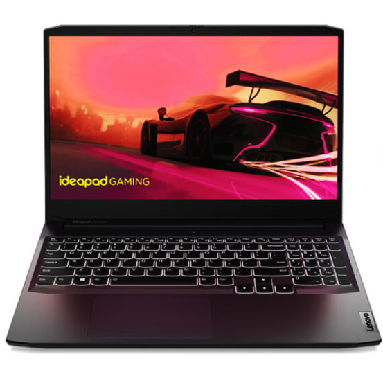
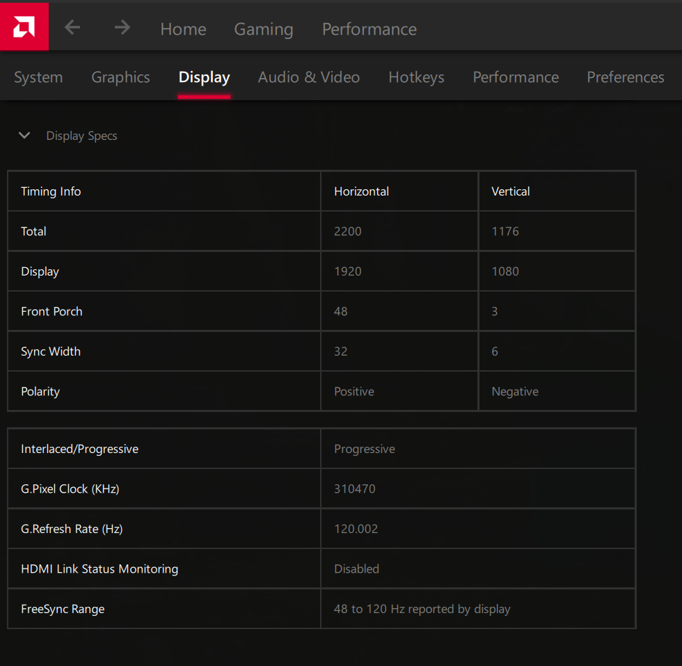
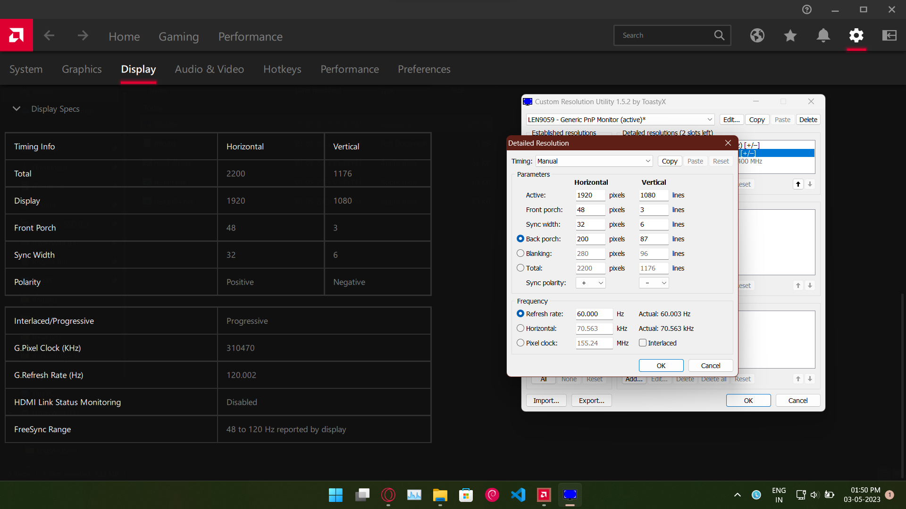
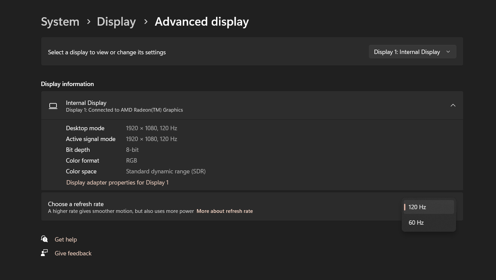
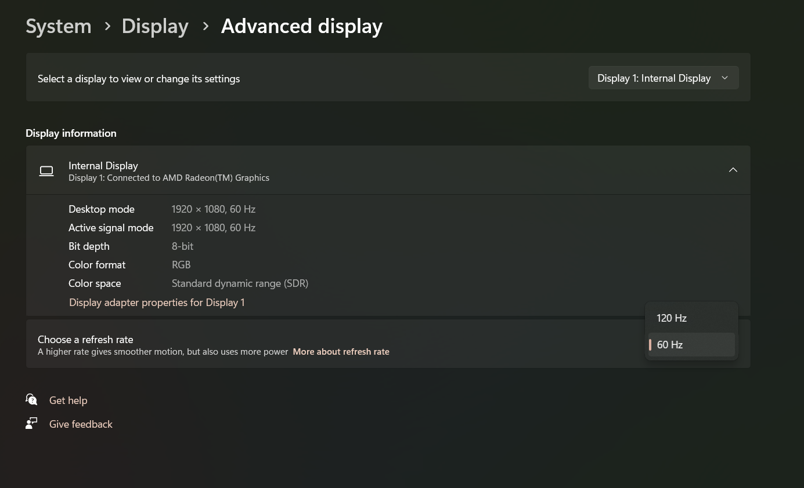
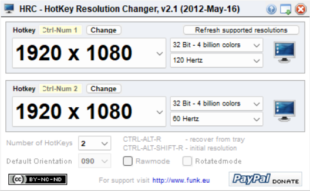

# Fix for Missing 60Hz Refresh Rate on Lenovo IdeaPad Gaming 3

## Issue Description
The Lenovo IdeaPad Gaming 3 typically defaults to a 120Hz refresh rate, with no option to switch to 60Hz. This can be inconvenient if you want to save battery life.

### Step 1: Check Your Display Specifications
To verify your display specifications, right-click on your desktop and select **AMD Software**, then navigate to **Display** > **Display Specs**.

Here, you should see the FreeSync Range listed as 48 to 120Hz, indicating that your display supports refresh rates below 120Hz. If this range isn’t displayed, your monitor may have a fixed refresh rate of 120Hz.

### Step 2: Download Custom Resolution Utility
Download the [Custom Resolution Utility (CRU)](https://www.monitortests.com/download/cru/cru-1.5.2.zip). 

Run the software, and you will see your current display refresh rate. Click on **Add**, and enter your display specifications to set it to 60Hz. Make sure to input the exact values for Display, Front Porch, Sync Width, Polarity, and Total as shown in AMD Software.

After entering the details, click **OK** and restart your laptop. You should now see the 60Hz option in your display settings.

Select **60Hz**, and you can verify that it’s working using any online refresh rate checker.

**Note**: If you experience distortion or lines on your display, connect your laptop to an external monitor using an HDMI cable and revert the refresh rate back to 120Hz. Make sure to check if you missed any details, but note that it will revert to 120Hz after 10 seconds.

### Quick Switch Method Between 120Hz and 60Hz
To quickly switch between 120Hz and 60Hz, install [Hotkey Resolution Changer (HRC)](https://funk.eu/wp-content/plugins/download-monitor/download.php?id=167).

Once installed, open the software to view your available resolutions (120Hz and 60Hz). Set your desired shortcut keys for both resolutions, such as *Ctrl + Numpad 1* for 120Hz and *Ctrl + Numpad 2* for 60Hz.

### Tested on the AMD Variant of Lenovo IdeaPad Gaming 3

### My System Specifications:
- **Model**: Lenovo IdeaPad Gaming 3 (AMD)
- **CPU**: AMD Ryzen 5600H
- **Graphics**: Nvidia GTX 1650
- **RAM**: 16 GB
- **OS**: Windows 11

**For Intel Users**: Refer to this issue for additional help - [Click Here](https://github.com/mohitbhatt-du/refresh_rate_fix_for_lig3/issues/1).

*I hope this guide works for you!*
